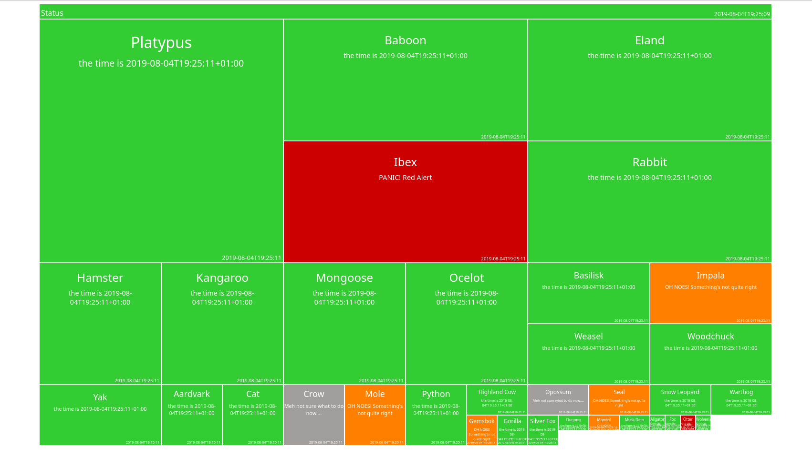

alive
=====

Alive is a dashboard backed by a restful API which displays the status of
whatever you desire. When the application is running it listens on 2 ports,
one is the API where your applications will send their updates and the other
is the website which displays colourful (green hopefully) boxes.



Run a demo
----------

### using go get

```
go get
```


### using docker

```
docker run baelish/alive alive
```
